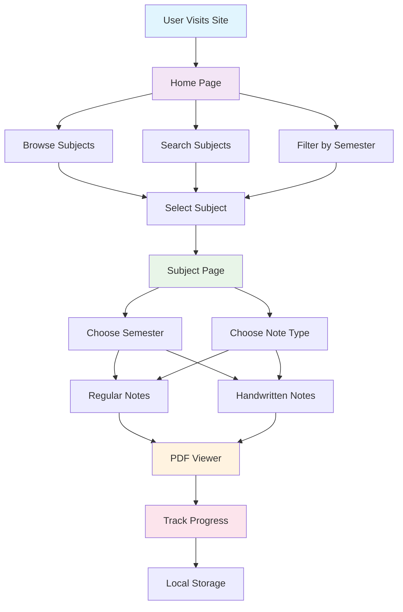
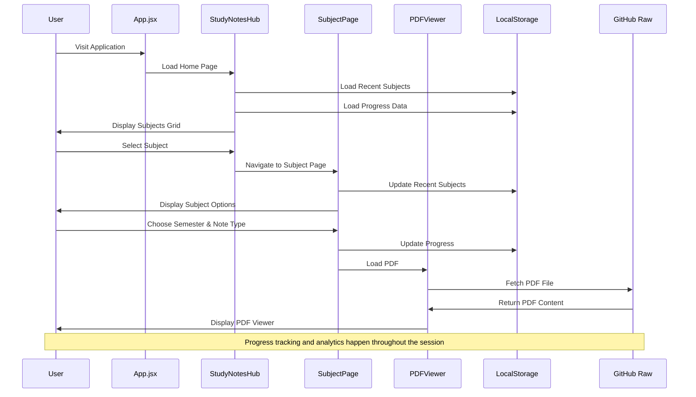

```mermaid
graph TB
    subgraph "Frontend Framework"
        A[React 18.3.1] --> B[Vite 5.4.1]
        B --> C[TypeScript 5.6.2]
    end
    
    subgraph "Styling & UI"
        D[Tailwind CSS 3.4.10] --> E[shadcn/ui]
        E --> F[Radix UI]
        F --> G[Lucide React]
    end
    
    subgraph "Routing & State"
        H[React Router 6.28.0] --> I[LocalStorage]
    end
    
    subgraph "Build & Deploy"
        J[Vite Build] --> K[Vercel Deployment]
        L[Vercel Analytics] --> K
    end
    
    subgraph "Development"
        M[ESLint 9.9.0] --> N[PostCSS]
        N --> O[Autoprefixer]
    end
    
    style A fill:#61dafb
    style D fill:#38bdf8
    style H fill:#f97316
    style J fill:#a855f7
    style L fill:#000000
```

# 📚 Study Notes Hub

[](https://github.com/rajofearth/study-notes-hub/blob/main/LICENSE)
[](https://vercel.com/analytics)
[](https://reactjs.org/)
[](https://vitejs.dev/)

**Study Notes Hub** is a modern, responsive web application designed to provide easy access to comprehensive study notes for various academic subjects. Built with React and featuring a beautiful UI, it offers seamless navigation between subjects, semesters, and note types with progress tracking and analytics.

## 🌐 Live Website

Access the live site at [Study Notes Hub](https://study-notes-hub.vercel.app/).

## 📊 Project Overview



## 🏗️ Architecture Diagram



```mermaid
graph LR
    subgraph "Frontend (React + Vite)"
        A[App.jsx] --> B[StudyNotesHub.jsx]
        B --> C[SubjectPage.jsx]
        B --> D[HomePage Components]
        C --> E[PDFViewer.jsx]
        D --> F[SubjectCard.jsx]
        D --> G[SubjectFilter.jsx]
        D --> H[SubjectsGrid.jsx]
    end
    
    subgraph "Styling & UI"
        I[Tailwind CSS] --> A
        I --> B
        I --> C
        J[shadcn/ui] --> A
        J --> B
        J --> C
    end
    
    subgraph "Routing & State"
        K[React Router] --> A
        L[LocalStorage] --> B
        L --> C
    end
    
    subgraph "External Services"
        M[Vercel Analytics] --> A
        N[GitHub Raw Content] --> E
    end
    
    subgraph "PDF Storage"
        O[public/pdfs/] --> E
        P[public/pdfs/hwn/] --> E
    end
    
    style A fill:#61dafb
    style B fill:#61dafb
    style C fill:#61dafb
    style E fill:#ff6b6b
    style M fill:#000000
    style N fill:#24292e
```

## 📑 Key Features

### 🎯 Core Functionality
- 📖 **Subject Browsing**: Organized by subjects and semesters with beautiful cards
- 📝 **Note Types**: Toggle between regular and handwritten notes
- 🔍 **Smart Search**: Find subjects quickly with real-time filtering
- 🎓 **Semester Filtering**: Filter subjects by semester (1 or 2)
- 📱 **Responsive Design**: Optimized for mobile and desktop devices

### 🚀 Advanced Features
- 🌙 **Dark/Light Mode**: Seamless theme switching with system preference detection
- 📊 **Progress Tracking**: Visual indicators showing which notes you've viewed
- 📈 **Analytics**: Built-in Vercel Analytics for usage insights
- 💾 **Local Storage**: Remembers your recently viewed subjects and progress
- 🎨 **Modern UI**: Beautiful interface built with shadcn/ui components

### 📄 PDF Management
- 🗂 **Integrated PDF Viewer**: Seamless note viewing without external downloads
- 📁 **Organized Storage**: Separate directories for regular and handwritten notes
- 🔗 **Direct Links**: Easy sharing with direct URLs to specific subjects/notes

## 🛠️ Technology Stack



## 📁 Project Structure

```
study-notes-hub/
├── 📁 src/
│   ├── 📁 components/
│   │   ├── 📁 homePage/
│   │   │   ├── SubjectCard.jsx      # Individual subject cards
│   │   │   ├── SubjectFilter.jsx    # Search and filter controls
│   │   │   └── SubjectsGrid.jsx     # Grid layout for subjects
│   │   ├── 📁 notesPage/
│   │   │   ├── NavigationBar.jsx    # Subject page navigation
│   │   │   ├── PdfViewer.jsx        # PDF rendering component
│   │   │   ├── PdfViewerSection.jsx # PDF viewer wrapper
│   │   │   └── SemesterTabs.jsx     # Semester selection tabs
│   │   ├── 📁 ui/                   # shadcn/ui components
│   │   ├── Header.jsx               # Main header with theme toggle
│   │   ├── study-notes-hub.jsx      # Main application logic
│   │   ├── subject-page.jsx         # Individual subject view
│   │   └── theme-provider.jsx       # Theme management
│   ├── App.jsx                      # Root component with routing
│   ├── main.jsx                     # Application entry point
│   └── index.css                    # Global styles
├── 📁 public/
│   ├── 📁 pdfs/                     # Regular notes storage
│   │   ├── 📁 hwn/                  # Handwritten notes
│   │   ├── os-s1.pdf               # Operating System S1
│   │   ├── cf-s1.pdf               # Computer Fundamentals S1
│   │   ├── c-s1.pdf, c-s2.pdf      # C Programming S1 & S2
│   │   └── ...                     # More subject notes
│   └── 📁 showcase/                 # Screenshots and assets
├── package.json                     # Dependencies and scripts
├── tailwind.config.js              # Tailwind configuration
├── vite.config.js                  # Vite build configuration
└── README.md                       # This file
```

## 🚀 Getting Started

### Prerequisites

- **Node.js** (v14 or higher)
- **npm** (bundled with Node.js)
- **Git** (for cloning the repository)

### Installation

1. **Clone the repository**:
   ```bash
   git clone https://github.com/rajofearth/study-notes-hub.git
   cd study-notes-hub
   ```

2. **Install dependencies**:
   ```bash
   npm install
   ```

3. **Start the development server**:
   ```bash
   npm run dev
   ```

4. **Open your browser** and navigate to `http://localhost:5173`

### Available Scripts

```bash
npm run dev          # Start development server
npm run build        # Create production build
npm run preview      # Preview production build
npm run lint         # Run ESLint
```

## 📝 Usage Guide

### 🏠 Home Page Navigation
- **Browse Subjects**: Scroll through all available subjects
- **Search**: Use the search bar to find specific subjects
- **Filter**: Use semester filter to show only S1 or S2 subjects
- **Recently Viewed**: See your recently accessed subjects at the top

### 📚 Subject Page Features
- **Semester Selection**: Choose between available semesters
- **Note Type Toggle**: Switch between regular and handwritten notes
- **PDF Viewer**: View notes directly in the browser
- **Progress Tracking**: Visual indicators show your viewing progress
- **Navigation**: Easy back navigation to home page

### 🎨 Theme Customization
- **Auto Detection**: Automatically matches your system theme
- **Manual Toggle**: Use the theme button in the header
- **Persistent**: Your preference is saved for future visits

## 📊 Data Flow Diagram



## 📸 Screenshots


*Home page showcasing subjects, search functionality, and recently viewed items*


*Subject page with semester selection, note type toggle, and integrated PDF viewer*

## 🤝 Contributing

We welcome contributions! Whether you want to add new subjects, improve existing features, or fix bugs, your help is appreciated.

**For detailed contribution guidelines**, please read our [CONTRIBUTORS.md](./CONTRIBUTORS.md) file which includes:
- 🚀 Complete setup instructions
- 🏗️ Project architecture explanation
- 📚 How to add new subjects and notes
- ⚙️ Local development configuration
- 🐛 Troubleshooting guide

**Quick Start for Contributors**:
1. Fork the repository
2. Read [CONTRIBUTORS.md](./CONTRIBUTORS.md) for detailed setup
3. Make your changes
4. Submit a Pull Request

Feel free to create an Issue for any questions, suggestions, or bug reports.

## 📈 Analytics & Performance

- **Vercel Analytics**: Built-in analytics for usage insights
- **Performance**: Optimized with Vite for fast loading
- **SEO**: Proper meta tags and structured data
- **Accessibility**: WCAG compliant design patterns

## 📧 Contact

Developed by [Yashraj Maher](https://github.com/rajofearth). For questions or feedback, please reach out via GitHub.

## 📄 License

This project is licensed under the MIT License. See the [LICENSE](https://github.com/rajofearth/study-notes-hub/blob/main/LICENSE) file for details.

---

Thank you for exploring Study Notes Hub! Enhance your learning journey with easy access to valuable resources. 🎓📖

---

*Last updated: December 2024*
